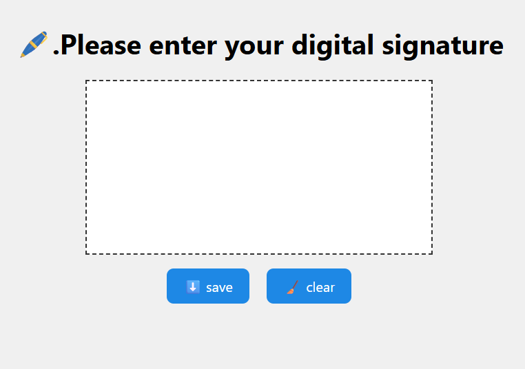

# ✍️ Signature Pad | Canvas-Based E-Signature with Download Feature

A modern, lightweight, and fully responsive **Signature Pad** built with HTML5 Canvas and JavaScript.  
Draw your signature, clear it, or **download it instantly as a PNG image**!

---


## 🖼️ Preview

  
*Simple and smooth drawing experience with one-click download*

---

## 🌟 Features

- ✏️ **Draw** using mouse or touch (mobile supported)
- 🧼 **Clear** canvas instantly with a button
- 💾 **Download** your signature as a high-quality `.png` image
- 📱 Fully **responsive** – works on desktop, tablet, and mobile
- ⚡ Smooth drawing using native Canvas API
- 🧠 Minimal, clean, and extendable codebase

---

## 🚀 Live Preview

👉 [View Live on GitHub Pages](https://mahdijds.github.io/signature-pad/)  
*(replace the URL with your actual GitHub Pages link)*

---

## ⚙️ Technologies Used

- 🧱 HTML5  
- 🎨 CSS3  
- ⚙️ JavaScript (Vanilla JS)  
- Canvas

---

## 📂 Project Structure

signature-pad/
├── index.html
├── style.css
├── app.js

---

## 📥 Getting Started


1. Clone or download this repo:  
   ```bash
   git clone https://github.com/MahdiJDS/signature-pad.git
   cd signature-pad
   ```
2. Open the index.html file in your browser.

3. drow your signature

---

## 📄 License

This project is licensed under the MIT License.

---

## 🧑‍💻 Developer

- [MahdiJDS on GitHub](https://github.com/MahdiJDS)  
- Email: mahdijahed56@gmail.com  

---